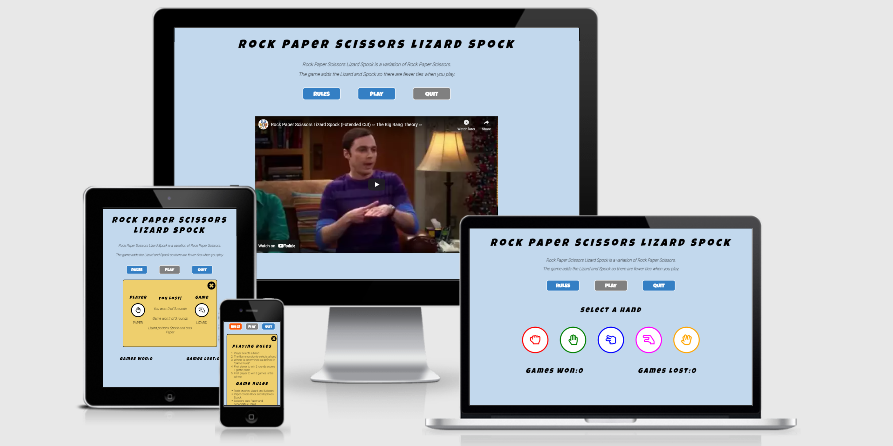
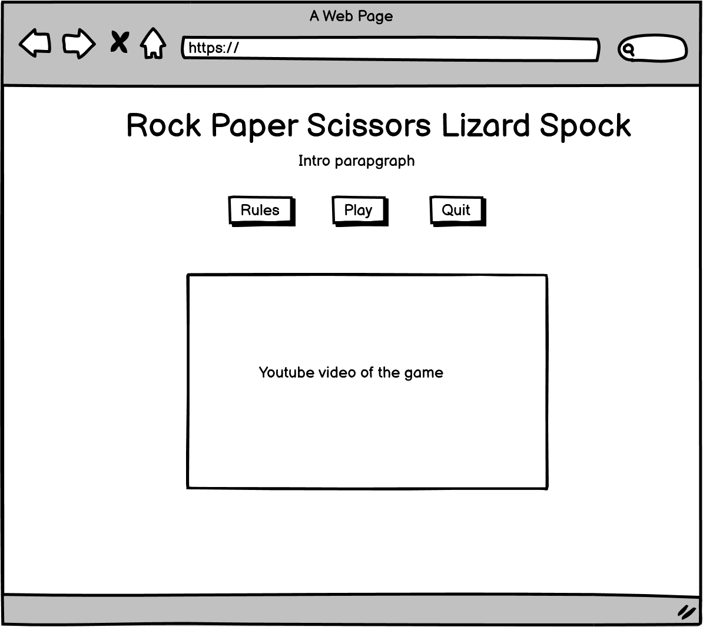
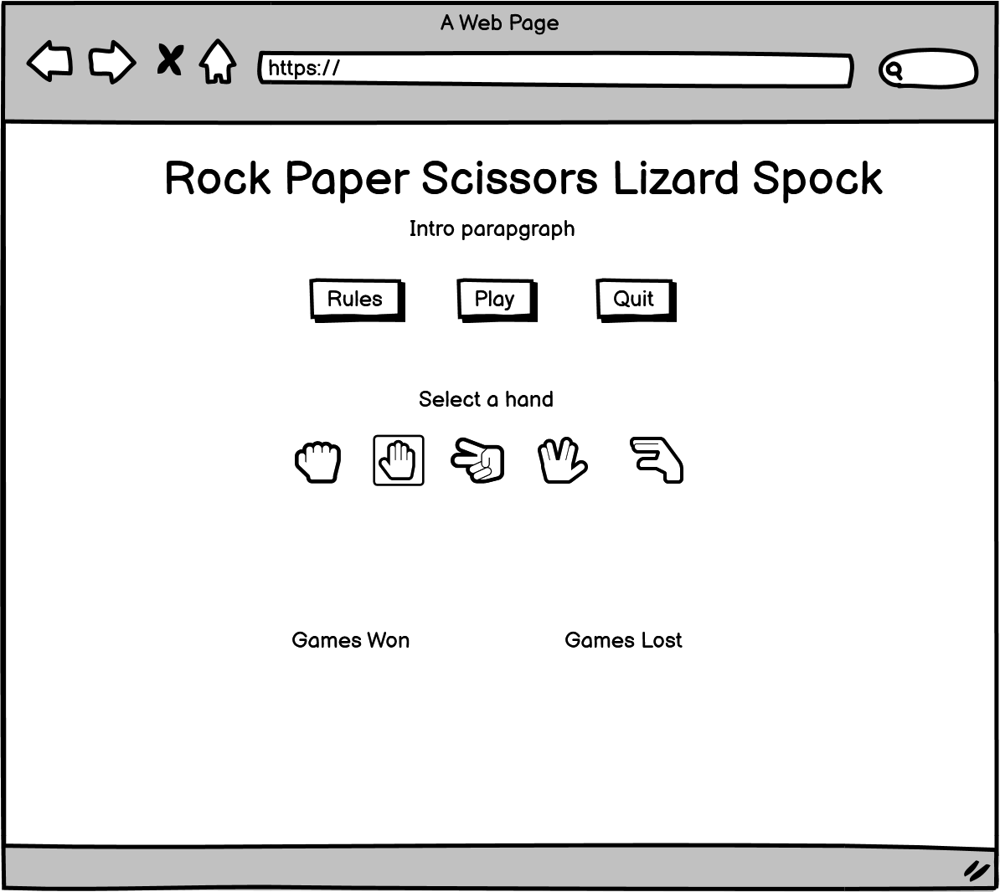
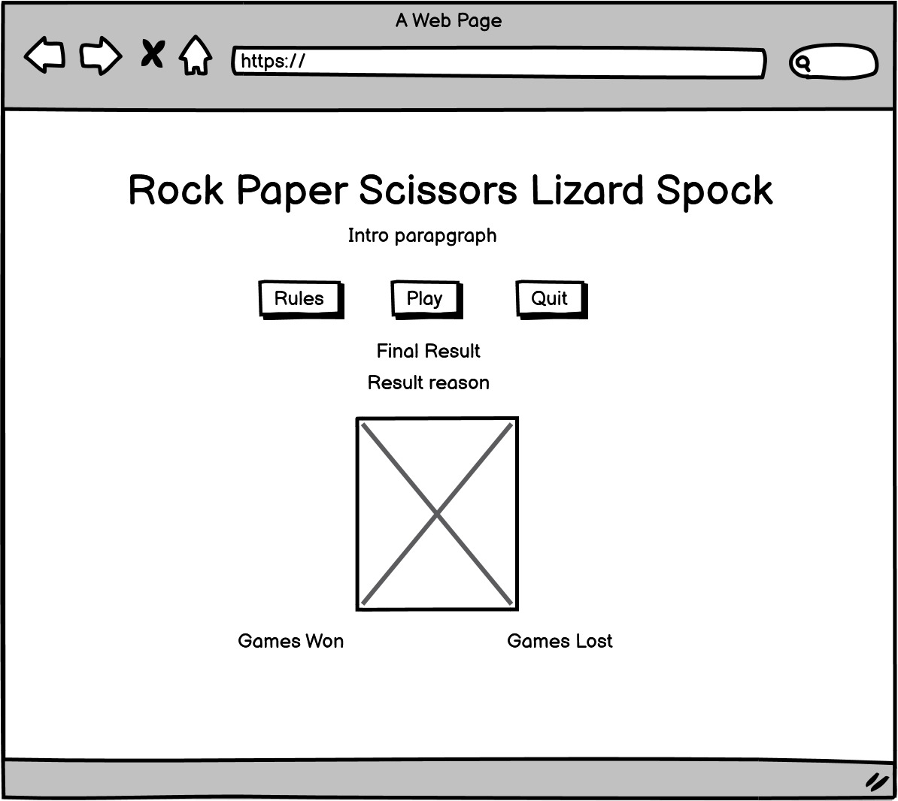

# Rock-Paper-Scissor-Lizard-Spock

## Introduction

### History

Rock-Paper-Scissors-Lizard-Spock is a variation of the Rock-Paper-Scissors hand game. The game of Rock-Paper-Scissors-Lizard-Spock was invented by a software engineer named Sam Kass.This game adds the Lizard and Spock so there are fewer ties when you play.

### Target Audience

The target audience of the site is for users that want to be challenged by a game of chance and have fun doing so. This site is intended to provide the user with an interactive and engaging experience.

The live site can be accessed [here](https://ashraafa.github.io/computerised-hand-game/)

## User Experience and Design

### User Stories
   1. As a player of the game, I want to know the rules of the game.
   2. As a player of the game, I want to start the game at any time.
   3. As a player of the game, I want to quit the game at any time.
   4. As a player of the game, I want to see the choice made by the game.
   5. As a player of the game, I want to see the reason I won or lost.
   6. As a player of the game, I want to see my progress.
   7. As a player of the game, I want to be know when the game is complete.

### Design
#### Wireframes
During the design phase it was decided that a separate mobile design was not needed due to the number of page elements and available page space that was not going to be consumed.  The user stories were considered when designing the mock-ups.

  * #### Landing Page
    * The page was designed to be the resting place before the user starts the game.

  * Game Display
    * The page was designed for the game controls that are displayed after the user clicks Play.

  * Results Message
   * The results message is a pop up that is displayed to provide feedback after each attempt by the user.

  * Final Feedback
   * The final feedback was designed to display the final result to the user.

* Colour Pallette
  * Point 1
  * Point 2

* Typography

## Featuues
This section introduces the feature that have been implemented to satisfy the user stories defined.

* Title and Information
  * Point 1

* Game Navigation Buttons
  * Rules
  * Point 1

* Play
  * Point 1

* Informational Video
  * 

* Player Controls
  * Point 1

* Game Score
  * Point 1 

* Round Won Message
 * Point 1

* Game Won Message
 * Point 1

* Final Result
 * Point 1

## Testing

* Use Cases
  * User Story
    * Use Case 1
    * Use Case 2

* Validator Testing
   * JavaScript
     * Point 1

  * HTML
    * Point 1

   * CSS
     * Point 1

   * Accessibility
     * Point 1

   * Mobile Responsiveness
     * Point 1

   * Desktop Browser Compatibility
     * Point 1

  ## Deployment

  ## Credits

