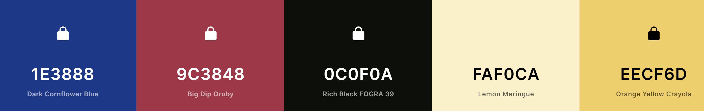
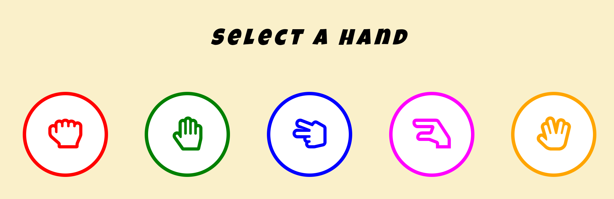
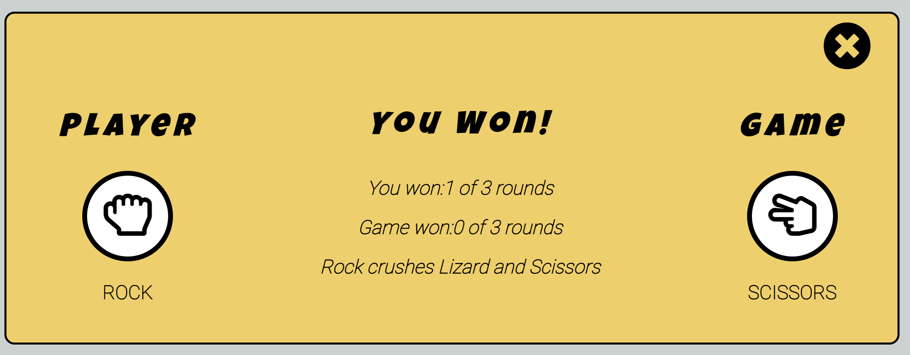

# Rock-Paper-Scissor-Lizard-Spock

## Introduction

* ### History

  Rock-Paper-Scissors-Lizard-Spock is a variation of the Rock-Paper-Scissors hand game. The game of Rock-Paper-Scissors-Lizard-Spock was invented by a software engineer named Sam Kass.This game adds the Lizard and Spock so there are fewer ties when you play.

* ### Target Audience

  The target audience of the site is for users that want to be challenged by a game of chance and have fun doing so. This site is intended to provide the user with an interactive and engaging experience.

The live site can be accessed [here](https://ashraafa.github.io/computerised-hand-game/)

## User Experience and Design

* ### User Stories
  1. As a player of the game, I want to know the rules of the game.
  2. As a player of the game, I want to start the game at any time.
  3. As a player of the game, I want to quit the game at any time.
  4. As a player of the game, I want to see the choice made by the game.
  5. As a player of the game, I want to see the reason I won or lost.
  6. As a player of the game, I want to see my progress.
  7. As a player of the game, I want to be know when the game is complete.

* ### Design
  * #### Wireframes
    During the design phase it was decided that a separate mobile design was not needed due to the number of page elements and available page space that was not going to be consumed.  The user stories were considered when designing the mock-ups.
 
  * #### Landing Page
    * The page was designed to be the resting place before the user starts the game.

  * Game Display
    * The page was designed for the game controls that are displayed after the user clicks Play.

  * Results Message
    * The results message is a pop up that is displayed to provide feedback after each attempt by the user.
 

  * Final Feedback
    * The final feedback was designed to display the final result to the user.

* Colour Palette
  * The color pallete below was generated by [Coolors](https://coolors.co/)
    * Dark Cornflower Blue was applied to the navigation buttons.
    * Big Dip Oruby was applied to the navigation buttons when hovered and focused.
    * Light Gray for the backgorund color of the game.
    * Orange Yellow Crayola was applied to the results messages.

* Typography
  * The main font used by the game for headings is the "Luckiest Guy" with Cursive as the fallback font. This font was selected due the retro design and also that is was a perfect font name for the game being played.
  * This font is supported by Roboto for all other text with Sans-Serif as the fallback font.

## Featuues
This section introduces the feature that have been implemented to satisfy the user stories that have been defined.

* Title and Information
  * The title is displayed in bold using the Luckiest Guy font and draws attention to the name of the game.
  * The section below the title adds some description as most users would likely be more familiar with the traditional Rock Paper Scissors game.

* Game Navigation Buttons
  * The game navigation consist of 3 buttons:
    * Rules button which displays the Game and Playing rules when clicked.
    * Play button which allows the user to start the game when clicked.
    * Quit button which allows the user to quit the game at any time.

* Informational Video
  * The informational video adds some humour whilst providing an overview of the general game rules.

* Player Controls
  * The player controls is dsiaplyed when the user clicks Play.
  * The controls make use of [Font Awesome](https://fontawesome.com/) icons using an array of bright colors.

* Game Score
  * The game score is displayed at the bottom of the game for visibility.
  * The winner is the player that is first to win 3 games and therefore the score needs to remain visible at all times.

* Round Result Message
  * The round result is displayed each time a player selects a hand. The result is either Won, Lost or Draw.
  * The message includes the player selection and game selection.
  * The message provides a result reason as well. These are the same reasons provided in the Rules section.
  * The number of rounds won is displayed in the message and allows user to keep track of the round score.

* Game Won Message
  * The game result is displayed each time any player wins 2 rounds.
  * The message includeds the player slection and game selection
  * The message provides a result reason as well. These are the same reasons provided in the Rules section.
  * The number of games won is not displayed in the message as it is visible on the main page.
  * The message includes a warning that if the user clicks Quit the game will be terminated.

* Final Result
 * The final result is displayed after the the first player wins 3 games.

## Testing

* Use Cases
  * User Story
    * Use Case 1
    * Use Case 2

* Validator Testing
   * JavaScript
     * Point 1

  * HTML
    * Point 1

   * CSS
     * Point 1

   * Accessibility
     * Point 1

   * Mobile Responsiveness
     * Point 1

   * Desktop Browser Compatibility
     * Point 1

  ## Deployment

  ## Credits

