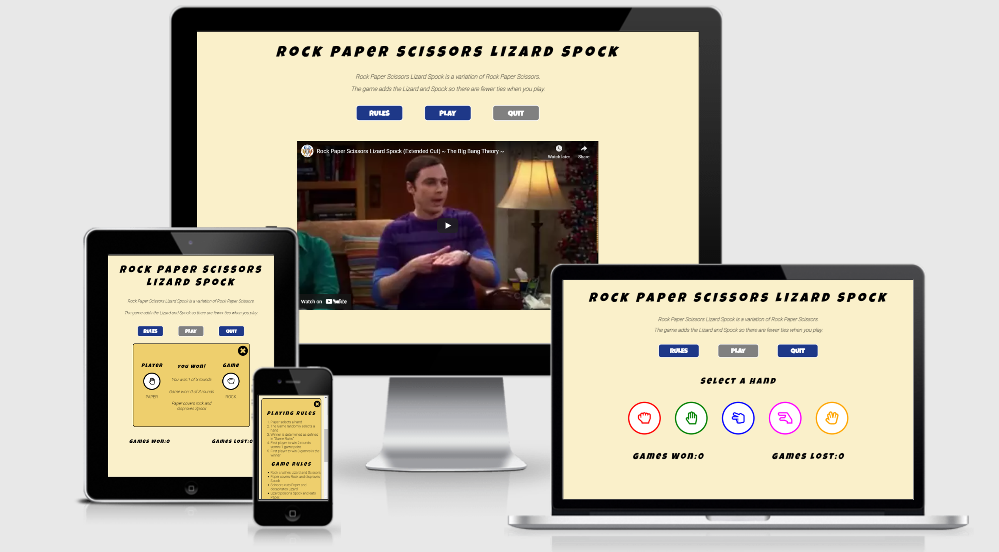
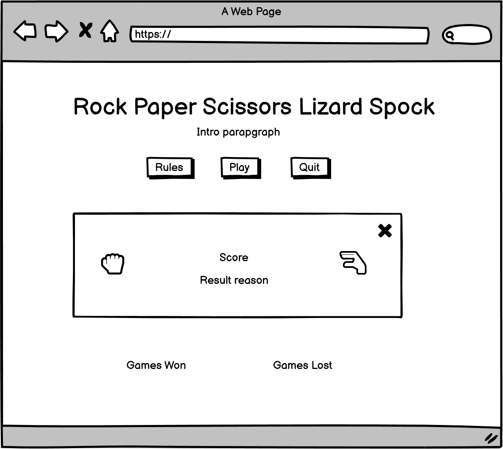
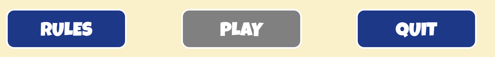
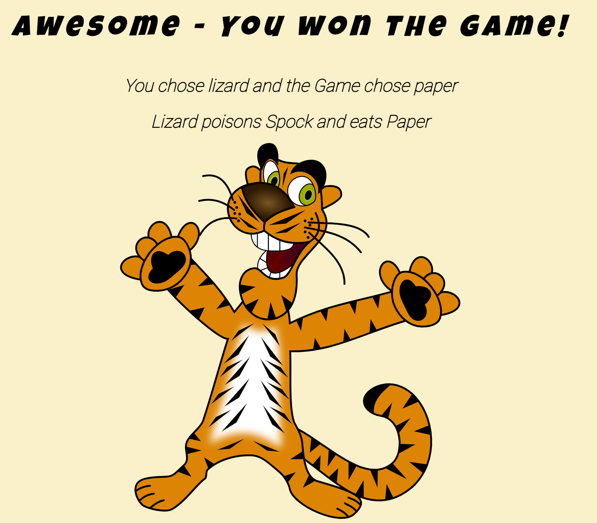
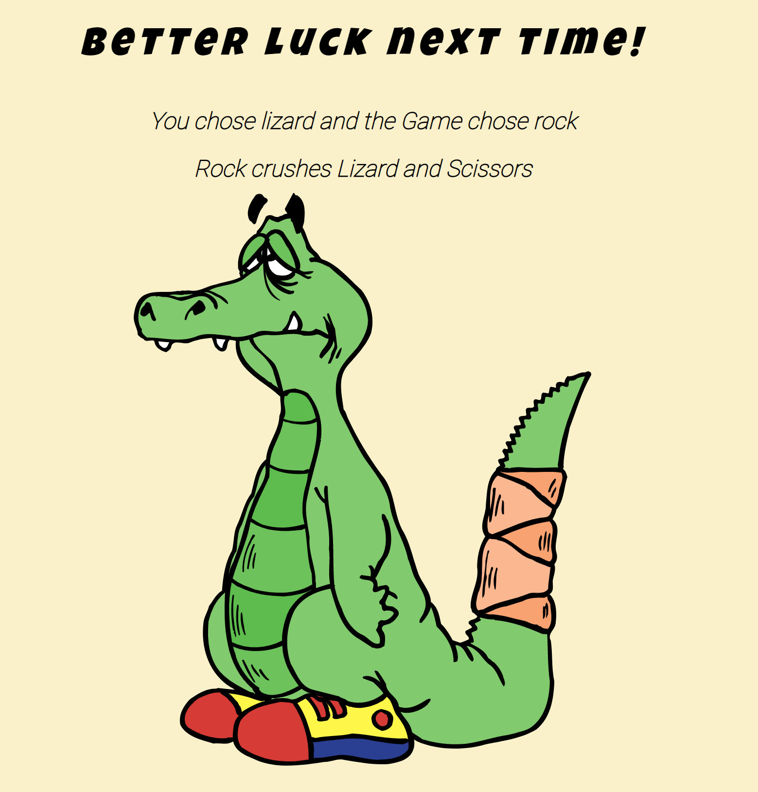
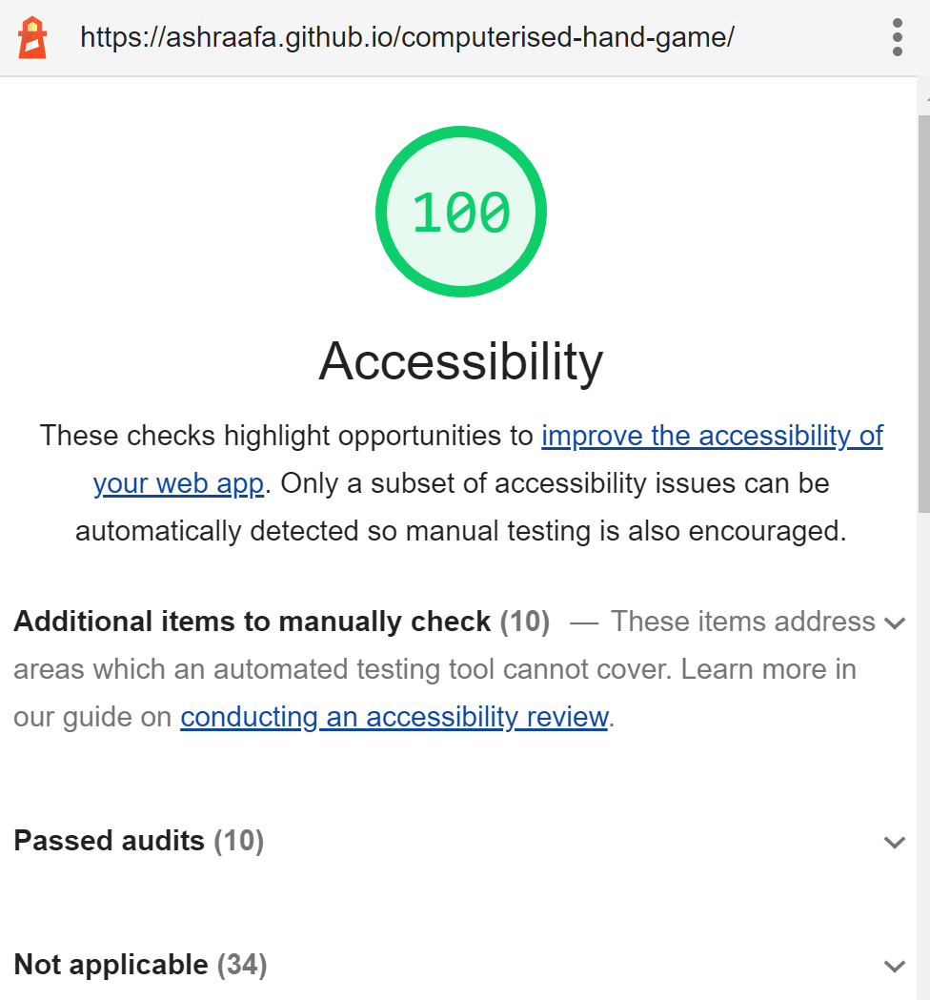

# Rock-Paper-Scissor-Lizard-Spock

## Table of Contents

- [1. Introduction](#1-introduction)
  * [History](#history)
  * [Target Audience](#target-audience)
- [2. User Experience and Design](#2-user-experience-and-design)
  * [User Stories](#user-stories)
  * [Design](#design)
- [3. Features](#3-features)
- [4. Testing](#4-testing)
  * [Use Case Testing](#use-case-testing)
  * [Validator Testing](#validator-testing)
- [5. Bug Fixes](#5-bug-fixes)
- [6. Deployment](#6-deployment)
- [7. Credits](#7-credits)

## 1. Introduction

* ### History

  Rock-Paper-Scissors-Lizard-Spock is a variation of the Rock-Paper-Scissors hand game. The game of Rock-Paper-Scissors-Lizard-Spock was invented by a software engineer named Sam Kass.This game adds the Lizard and Spock so there are fewer ties when you play.

* ### Target Audience

  The target audience of the site is for users that want to be challenged by a game of chance and have fun doing so. This site is intended to provide the user with an interactive and engaging experience.

The live site can be accessed [here](https://ashraafa.github.io/computerised-hand-game/)

## 2. User Experience and Design

* ### User Stories
  * As a player of the game, I want to know the rules of the game.
  * As a player of the game, I want to start the game at any time.
  * As a player of the game, I want to quit the game at any time.
  * As a player of the game, I want to see the choice made by the game.
  * As a player of the game, I want to see the reason I won or lost.
  * As a player of the game, I want to see my progress.
  * As a player of the game, I want to know when the game is complete.

* ### Design
  * Wireframes
    During the design phase it was decided that a separate mobile design was not needed due to the number of page elements and available page space that was not going to be consumed.  The user stories were considered when designing the mock-ups.
 
  * Landing Page
    * The page was designed to be the resting place before the user starts the game.

      

  * Game Display
    * The page was designed for the game controls that are displayed after the user clicks Play.

      

  * Results Message
    * The results message is a pop up that is displayed to provide feedback after each attempt by the user.
 
      

  * Final Feedback
    * The final feedback was designed to display the final result to the user.

      

* Colour Palette
  * The color palette below was generated by [Coolors](https://coolors.co/)
    * Dark Cornflower Blue was applied to the navigation buttons.
    * Big Dip Oruby was applied to the navigation buttons when hovered and focused.
    * Lemon Meringue for the background color of the game.
    * Orange Yellow Crayola was applied to the results messages.

      

* Typography
  * The main font used by the game for headings is the "Luckiest Guy" with Cursive as the fallback font. This font was selected due the retro design and also that it was a perfect font name for the game being played.
  * This font is supported by Roboto for all other text with Sans-Serif as the fallback font.

    

## 3. Features
This section introduces the features that have been implemented to satisfy the user stories that have been defined.

* Title and Information
  * The title is displayed in bold using the Luckiest Guy font and draws attention to the name of the game.
  * The section below the title adds some description as most users would likely be more familiar with the traditional Rock Paper Scissors game.

    

* Game Navigation Buttons
  * The game navigation consists of 3 buttons:
    * Rules button which displays the Game and Playing rules when clicked.
    * Play button which allows the user to start the game when clicked.
    * Quit button which allows the user to quit the game at any time.

      

* Informational Video
  * The informational video adds some humour whilst providing an overview of the general game rules.

    

* Player Controls
  * The player controls are displayed when the user clicks Play.
  * The controls make use of [Font Awesome](https://fontawesome.com/) icons using an array of bright colors.

    

* Game Score
  * The game score is displayed at the bottom of the game for visibility.
  * The winner is the player that is first to win 3 games and therefore the score needs to remain visible at all times.

    

* Round Result Message
  * The round result is displayed each time a player selects a hand. The result is either Won, Lost or Draw.
  * The message includes the player selection and game selection.
  * The message provides a result reason as well. These are the same reasons provided in the Rules section.
  * The number of rounds won is displayed in the message and allows user to keep track of the round score.

    

    

* Game Won Message
  * The game result is displayed each time any player wins 2 rounds.
  * The message includes the player selection and game selection
  * The message provides a result reason as well. These are the same reasons provided in the Rules section.
  * The number of games won is not displayed in the message as it is visible on the main page.
  * The message includes a warning that if the user clicks Quit the game will be terminated.

    

    

* Final Result
  * The final result is displayed after the first player wins 3 games.

    

    

## 4. Testing

* ### Use Case Testing

  * As a player of the game, I want to know the rules of the game.

    * Player can click Rules button to display game rules once the landing page has loaded.
    * Player can access rules via the Rules button whilst the game controls are displayed.
    * Player can access the rules via the Rules button when a round result message is displayed.
    * Player can access the rules via the Rules button when a game result message is displayed.

  * As a player of the game, I want to start the game at any time.

    * Player can start the game immediately after the page loads by clicking the Play button.
    * Player must close the Rules message before the Play button is enabled again.

  * As a player of the game, I want to quit the game at any time.

    * Player can click the Quit button at any time during the game.
    * The current round scores are reset to zero when the user clicks the Quit button.
    * The current game scores are reset to zero when the user clicks the Quit button.

  * As a player of the game, I want to see the choice made by the game.

    * Player can see the game's choice on the round results message window.
    * Player can see the game's choice on the game results message window.
    * Player can see the game's choice on the finals results message window.

  * As a player of the game, I want to see the reason I won or lost.
    * Player can see the result reason on the round results message window.
    * Player can see the result reason on the game results message window.
    * Player can see the result reason on the final results message window.

  * As a player of the game, I want to see my progress
    * Player can view the number of games won at all times when the game is active

  * As a player of the game, I want to know when the game is complete.
    * Player gets a final result won message if the player is the first to win 3 games.
    * Player gets a final result lost message if the game is the first to win 3 games.

* ### Validator Testing
  * JavaScript
    * No errors were found when passing through the official [JSHint validator](https://jshint.com/)

  * HTML
    * No errors were returned when passing through the official [W3C validator](https://validator.w3.org/)

  * CSS
     * No errors were found when passing through the official [Jigsaw validator](https://jigsaw.w3.org/css-validator/)

  * Accessibility
     * Score 100% using Lighthouse in Chrome DevTools

       

  * Mobile Responsiveness
     * Minimum screen width for responsive design was done at 320px.
     * Mobile responsiveness was limited to the "toggle device" feature in Chrome Developer Tools due to lack of access to more physical devices.
     * Responsive design testing on physical devices were done on an iPhone 8 and iPad (6th Generation).

  * Desktop Browser Compatibility
     * Site was tested in the following browsers:
      * Microsoft Edge Version 94.0.992.31 (Official build)  (64-bit)
      * Chrome Version 94.0.4606.61 (Official Build) (64-bit)

## 5. Bug Fixes

| Bug | Solution |
| --------------- | --------------- |
| 1. When a game is a draw the reason is not displayed | Value for resultReason was missing in the calculateResult function |
| 2. Game score displays 0 but after winning the score increments to last won value | Updated the resetGameScore function to set the gameScoreWon and gameScoreLost value to 0 |
| 3. Result message not displaying the selected hand options  | Add data-type to icon since the attribute did not exist and therefore when user clicked the icon it would set the value as undefined |
| 4. JSHint gave warning "Functions declared within loops referencing an outer scoped variable may lead to confusing semantics" | Removed function from btn.eventListener when Play is clicked and created a separate event listener specifically for the Play button |
| 5. Close button on rules not displaying on smaller screens | Set the relative position for the rules close button |
| 6. HTML validator identified frameless border as being deprecated | Removed frameless border from iframe tag and set property in CSS instead |
| 7. Aria-label misuse warning from HTML validator | Removed aria-label from icon and set on game control button instead |
| 8. Video continues playing after display for video-wrapper is set to none | Created a function that resets iframe.src |

## 6. Deployment

The site was deployed to GitHub pages. The steps to deploy are as follows: 
  * In the GitHub repository, navigate to the Settings tab.
  * On the left menu list, select Pages.
  * In the source section drop-down menu, select the Main Branch and click Save.
  * Upon successful save, the Github Pages section will display a message to indicate that the site is ready to be published at https://ashraafa.github.io/computerised-hand-game/.

## 7. Credits

The following section identifies websites and individuals that supported me whilst building the game site.
 
  * [Code Institute Course Material](https://learn.codeinstitute.net/)
  * Reuben Ferrante - Senior Python Developer for his mentorship regarding best industry practices
  * [Balsamiq for wireframes](https://balsamiq.com/)
  * [JavaScript - w3schools](https://www.w3schools.com/jsref/)
  * [JavaScript - MDN Web Docs](https://developer.mozilla.org/en-US/docs/Web/JavaScript)
  * [HTML - w3schools](https://www.w3schools.com/html/)
  * [CSS - w3schools](https://www.w3schools.com/css/)
  * [General JavaScript, HTML & CSS](https://stackoverflow.com/)
  * [Font Awesome for icons](https://fontawesome.com/)
  * [Google Fonts for fonts](https://fonts.google.com/)
  * [Coolors for color palettes and contrast checker](https://coolors.co/)
  * [Pixabay for images](https://pixabay.com/)

